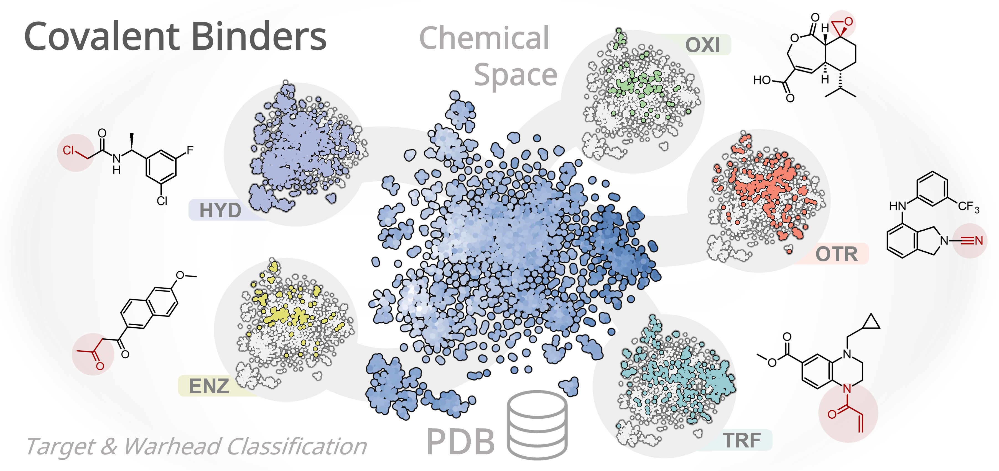

# Covalent_Binders_DB
A curated database of covalent binders (CBs) in the Protein Data Bank (PDB) through January 1, 2026.

**Velasco-Saavedra, M.A., et al. (2026).**
*Chemical Space Exploration of a Database of Covalent Binders in the PDB*.
*Journal of Chemical Information and Modeling*.
DOI: [10.1021/acs.jcim.6c00846](https://doi.org/10.1021/acs.jcim.6c00846)

  

## 01_CovDB.csv  
	- Covalent binder identifier (CBID)
	- SMILES notation (SMILES)
	- Molecular weight (MW)
	- Number of hydrogen bond acceptors (HBA) and donors (HBD)
	- Calculated logarithm of the octanol-water partition coefficient (cLogP)
	- Topological polar surface area (TPSA)
	- Fraction of sp3-hybridized carbon atoms (CSP3)
	- Number of rings (NumRings)
	- Number of heteroatoms (HetAtoms)
	- Number of rotatable bonds (RotBonds)
	- Values used for t-SNE, UMAP, and PCA plots
	
Each covalent binder is annotated to indicate whether it is a fragment, a FDA-approved drug (DrugBank ID), and/or present in the COCONUT database (COCONUT ID).

## 02_Warheads.csv
	- Covalent binder identifier (CBID)
	- Full (Warhead-01) and summarized (Warhead-02) warhead notation

## 03_PDBs.csv
	- Covalent binder identifier (CBID): The unique identifier assigned to each covalent ligand
	- PDB ligand identifier (LIGID): The identifier assigned by the PDB to the ligand
	- PDB identifier (PDB): The Protein Data Bank code associated with the structure
	- Protein classification (CLASS)

CLASS: hydrolases (HYD), transferases (TRF), oxidoreductases (OXI), lyases (LYA), isomerases (ISO), ligases (LIG), translocases (TRL), and non-enzymatic targets (OTR).
